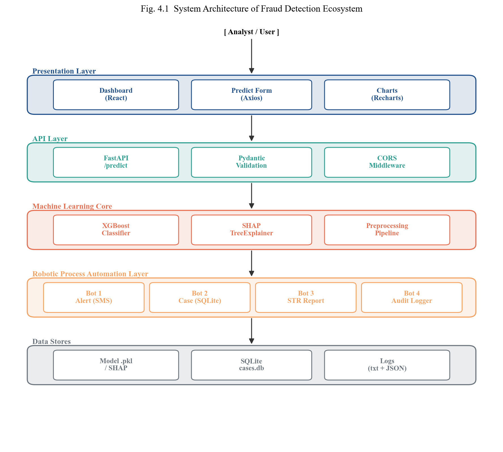
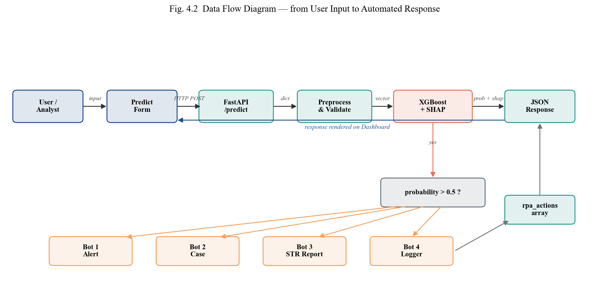
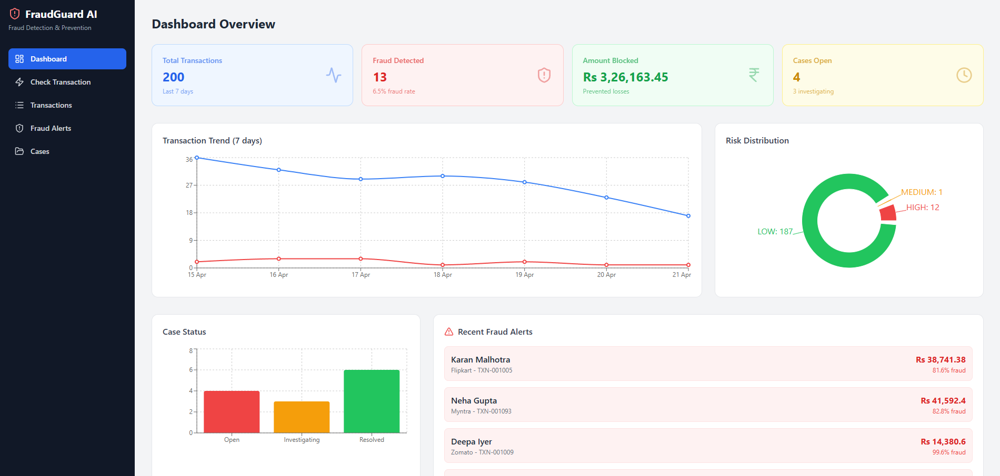
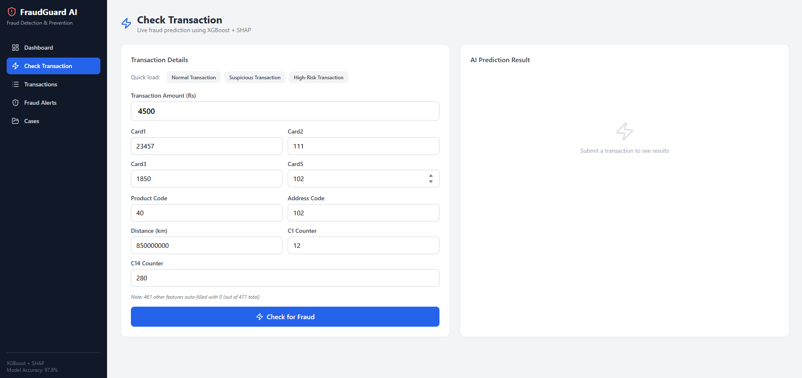
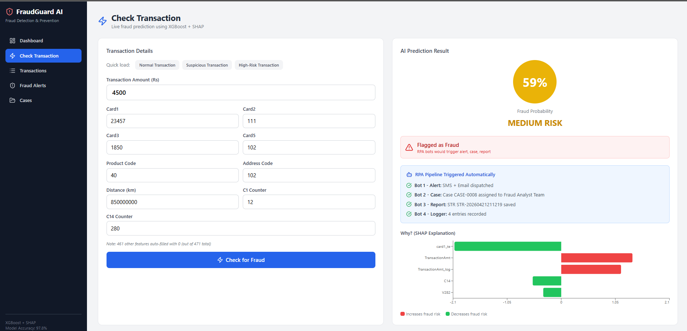
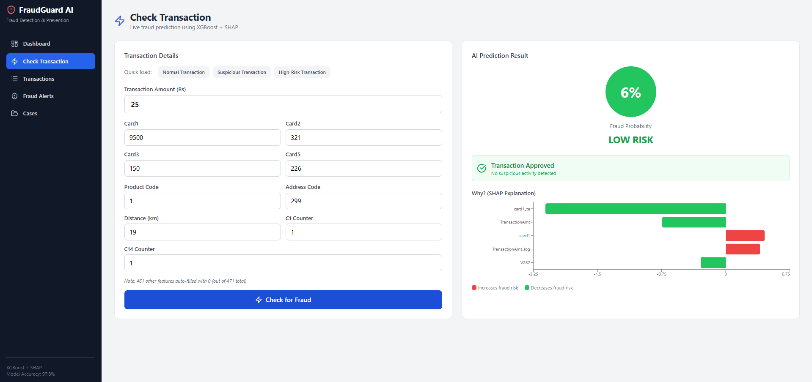
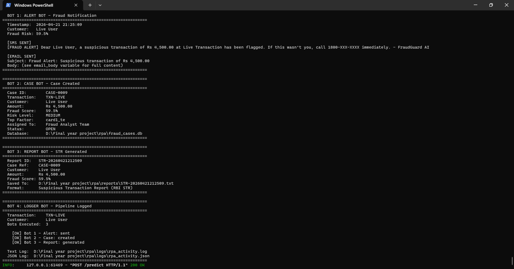
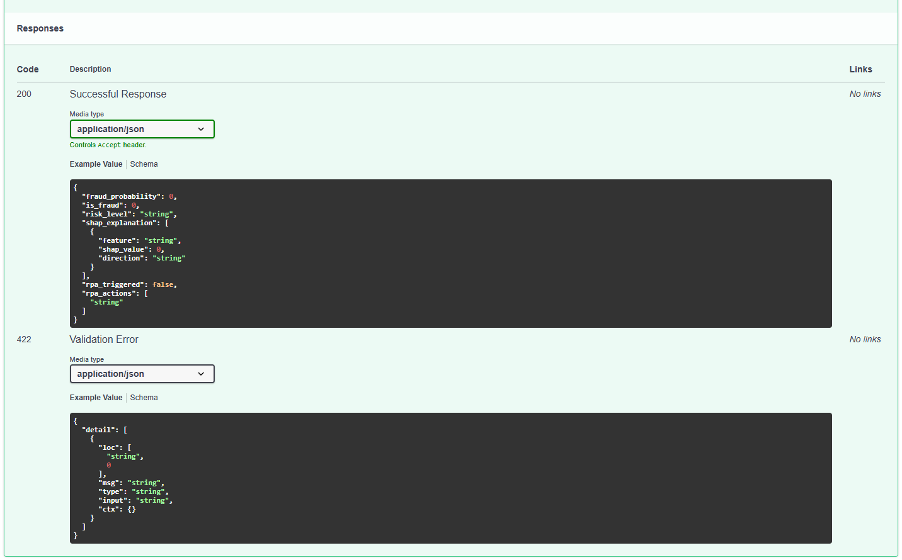

# AI-Powered Fraud Detection & Prevention Ecosystem with RPA

> End-to-end banking fraud detection system combining **XGBoost** classification, **SHAP** explainability, a **FastAPI** backend, a **React 19** analyst dashboard, and a **4-bot Python RPA** pipeline for automated customer alerts, case management, regulatory reporting, and audit logging.

[](https://www.python.org/)
[](https://fastapi.tiangolo.com/)
[](https://react.dev/)
[](https://xgboost.readthedocs.io/)
[](#license)

---

## Table of Contents

- [Overview](#overview)
- [Key Results](#key-results)
- [System Architecture](#system-architecture)
- [Tech Stack](#tech-stack)
- [Features](#features)
- [Screenshots](#screenshots)
- [Project Structure](#project-structure)
- [Installation & Setup](#installation--setup)
- [API Usage](#api-usage)
- [RPA Pipeline](#rpa-pipeline)
- [Dataset](#dataset)
- [Publication](#publication)
- [Authors](#authors)
- [License](#license)

---

## Overview

Financial fraud causes over **$33 billion** in annual losses worldwide, and traditional rule-based detection systems struggle with both accuracy and response time. This project addresses both gaps by combining:

1. **Machine Learning** — a supervised XGBoost classifier trained on 590K+ transactions for accurate fraud detection.
2. **Explainable AI** — SHAP values accompany every prediction, showing the top-5 features that drove the decision.
3. **Robotic Process Automation (RPA)** — four Python bots trigger automatically when fraud is detected, handling customer notification, case creation, regulatory reporting, and audit logging in under 2 seconds.

The result is an integrated ecosystem where **detection, explanation, and response** happen as a single automated pipeline — replacing a 10–15 minute manual workflow with a sub-2-second automated one.

---

## Key Results

Trained and benchmarked four classifiers on the **IEEE-CIS Fraud Detection dataset** (590,540 transactions, 471 features, 3.5% fraud rate).

| Model | Precision | Recall | F1-Score | AUC-ROC |
|---|---:|---:|---:|---:|
| **XGBoost** ⭐ | **0.8935** | 0.5440 | **0.6762** | **0.9522** |
| LightGBM | 0.8419 | 0.5183 | 0.6417 | 0.9445 |
| Random Forest | 0.8692 | 0.4950 | 0.6308 | 0.9367 |
| AdaBoost | 0.2812 | 0.7108 | 0.4030 | 0.8891 |

> XGBoost was selected as the production model based on its balance of precision (**89%**) and AUC-ROC (**0.95**).

**End-to-end latency:** ~1.4 seconds from transaction submission to all 4 RPA bots completing.

---

## System Architecture



The system follows a **four-layer architecture**:

1. **Client Layer** — React 19 dashboard for analyst interaction
2. **Service Layer** — FastAPI backend with Pydantic validation and CORS
3. **Intelligence Layer** — XGBoost model + SHAP TreeExplainer
4. **Automation Layer** — 4 Python RPA bots + SQLite case database



---

## Tech Stack

| Layer | Technologies |
|---|---|
| **Machine Learning** | Python 3.10, scikit-learn, XGBoost, LightGBM, SHAP, SMOTE (imbalanced-learn), pandas, NumPy |
| **Backend API** | FastAPI, Pydantic v2, Uvicorn, asyncio lifespan |
| **Frontend** | React 19, Tailwind CSS 3, Axios, Recharts, React Router |
| **Automation** | Python RPA bots, SQLite 3 |
| **Dev Tools** | Kaggle (GPU training), Git, npm, VS Code |

---

## Features

### Detection
- XGBoost classifier with **F1 = 0.6762** and **AUC-ROC = 0.9522**
- SMOTE applied **post-split** (no data leakage)
- Handles 471 engineered features from Vesta transaction data

### Explainability
- Per-transaction SHAP top-5 feature attributions
- Direction indicator (increases / decreases fraud risk)
- Global SHAP feature importance and beeswarm visualizations

### Dashboard
- Live prediction form with risk level (LOW / MEDIUM / HIGH)
- Interactive SHAP bars per prediction
- Transactions history and alerts queue
- Real-time RPA action feed

### RPA Pipeline (triggered when fraud probability > 0.5)
- **Bot 1 — Alert:** Customer SMS + email notifications
- **Bot 2 — Case:** Opens investigation ticket with risk-based routing
- **Bot 3 — Report:** Generates RBI-format Suspicious Transaction Report (STR)
- **Bot 4 — Logger:** Writes immutable audit trail

---

## Screenshots

| Dashboard Home | Prediction Form |
|---|---|
|  |  |

| Fraud Result with SHAP | Legitimate Result |
|---|---|
|  |  |

| RPA Terminal Output | Swagger API Response |
|---|---|
|  |  |

---

## Project Structure

```
AI-Powered-Fraud-Detection-Prevention-Ecosystem-with-RPA/
├── ml/                     # Data preprocessing, training, prediction
│   ├── predict.py          # load_model() + predict() with SHAP
│   └── feature_names.pkl
├── api/                    # FastAPI backend
│   ├── app.py              # /predict endpoint + RPA orchestration
│   └── requirements.txt
├── dashboard/              # React 19 + Tailwind analyst UI
│   ├── src/
│   └── package.json
├── rpa/                    # Four Python RPA bots
│   ├── bot1_alert.py       # Customer SMS + email
│   ├── bot2_case.py        # SQLite case management
│   ├── bot3_report.py      # RBI STR generator
│   ├── bot4_logger.py      # Audit trail
│   └── run_all.py          # Standalone bot demo
├── diagrams/               # Architecture & design figures
├── screenshot/             # Dashboard screenshots
├── logos/                  # GEHU logos
├── Project_Report.docx     # Full B.Tech project report (GEHU format)
├── Fraud_Detection_Paper.docx  # IEEE conference paper
├── model_comparison.png    # Model benchmark chart
├── confusion_matrices*.png # Confusion matrices
├── shap_*.png              # SHAP visualizations
└── README.md
```

---

## Installation & Setup

### Prerequisites

- Python 3.10+
- Node.js 18+ and npm
- Git

### 1. Clone the repository

```bash
git clone https://github.com/rohanthakur6767/AI-Powered-Fraud-Detection-Prevention-Ecosystem-with-RPA.git
cd AI-Powered-Fraud-Detection-Prevention-Ecosystem-with-RPA
```

### 2. Set up the Python backend

```bash
# Create and activate virtual environment
python -m venv venv
source venv/bin/activate          # Linux / macOS
venv\Scripts\activate             # Windows

# Install dependencies
pip install -r api/requirements.txt
```

### 3. Download the trained model

> The trained XGBoost model (`fraud_detection_xgboost.pkl`) is excluded from git due to size. You can either:
> - **Retrain it yourself** — download the [IEEE-CIS dataset](https://www.kaggle.com/competitions/ieee-fraud-detection) and run `python fraud_detection_pipeline.py`, or
> - **Contact the authors** for a pre-trained copy.

Place the model file in `ml/` alongside `predict.py`.

### 4. Start the FastAPI backend

```bash
cd api
uvicorn app:app --reload --host 127.0.0.1 --port 8000
```

Open Swagger UI at: **http://127.0.0.1:8000/docs**

### 5. Start the React dashboard

```bash
cd dashboard
npm install
npm start
```

Dashboard opens at: **http://localhost:3000**

---

## API Usage

### Health check

```bash
curl http://127.0.0.1:8000/health
```

### Predict fraud

```bash
curl -X POST http://127.0.0.1:8000/predict \
  -H "Content-Type: application/json" \
  -d '{
    "TransactionAmt": 45000,
    "ProductCD": 1,
    "card1": 13553,
    "C1": 12
  }'
```

### Sample response

```json
{
  "fraud_probability": 0.9247,
  "is_fraud": 1,
  "risk_level": "HIGH",
  "shap_explanation": [
    { "feature": "TransactionAmt", "shap_value": 1.32, "direction": "increases fraud risk" },
    { "feature": "V258",           "shap_value": 0.87, "direction": "increases fraud risk" },
    { "feature": "card1",          "shap_value": 0.54, "direction": "increases fraud risk" },
    { "feature": "C13",            "shap_value": 0.31, "direction": "increases fraud risk" },
    { "feature": "V201",           "shap_value": 0.22, "direction": "increases fraud risk" }
  ],
  "rpa_triggered": true,
  "rpa_actions": [
    { "bot": "Bot 1 - Alert",  "status": "sent",      "detail": "SMS + Email dispatched" },
    { "bot": "Bot 2 - Case",   "status": "created",   "detail": "Case CASE-0042 assigned to Senior Fraud Analyst" },
    { "bot": "Bot 3 - Report", "status": "generated", "detail": "STR STR-0042 saved" },
    { "bot": "Bot 4 - Logger", "status": "logged",    "detail": "4 entries recorded" }
  ]
}
```

---

## RPA Pipeline

The four bots live in `rpa/` and are orchestrated automatically by the `/predict` endpoint whenever `fraud_probability > 0.5`.

You can also run them standalone for a demo:

```bash
cd rpa
python run_all.py
```

### Risk-based case routing (Bot 2)

| Fraud Probability | Risk Level | Assigned To |
|---|---|---|
| ≥ 0.70 | HIGH | Senior Fraud Analyst |
| ≥ 0.30 | MEDIUM | Fraud Analyst Team |
| < 0.30 | LOW | Auto-Review Queue |

### Artifacts generated

- `rpa/alerts/*.txt` — customer notifications
- `rpa/fraud_cases.db` — SQLite case database
- `rpa/reports/*.txt` — RBI-format STR reports
- `rpa/pipeline_log.txt` — audit trail

---

## Dataset

- **Source:** [IEEE-CIS Fraud Detection (Kaggle)](https://www.kaggle.com/competitions/ieee-fraud-detection)
- **Size:** 590,540 transactions
- **Features:** 471 (after preprocessing)
- **Fraud rate:** 3.5% (severe class imbalance)
- **Handling:** SMOTE applied **only to the training partition** after train-test split

Raw dataset files (`train_transaction.csv`, etc.) are excluded from this repo due to size. Download them from Kaggle and place in `Data/`.

---

## Publication

This work has been documented in an IEEE-format conference paper:

> **Rohan Thakur**
> *"AI-Powered Fraud Detection & Prevention Ecosystem with Robotic Process Automation (RPA),"*
> Manuscript prepared for IEEE Conference submission, Department of Computer Science & Engineering, Graphic Era Hill University, Dehradun, 2026.

The full project report (`Project_Report.docx`) and paper manuscript (`Fraud_Detection_Paper.docx`) are included in the repo.

---

## Authors

| Name | Roll No.
|---|---|---|
| **Rohan Thakur** | 2318035 


**Project Guide:** Mrs. Neha Pokhriyal, Assistant Professor, Department of CSE
**Institution:** Graphic Era Hill University, Dehradun
**Program:** B.Tech CSE (Hons.) in Machine Learning and Artificial Intelligence
**Group:** 318 | **Submission:** May 2026

---

## License

This project is released under the **MIT License**. See [LICENSE](LICENSE) for details.

The IEEE-CIS dataset is subject to its own [competition rules](https://www.kaggle.com/competitions/ieee-fraud-detection/rules) and is not redistributed here.

---

## Acknowledgements

- **IEEE-CIS** and **Vesta Corporation** for releasing the fraud detection dataset.
- The **scikit-learn**, **XGBoost**, **LightGBM**, **SHAP**, **FastAPI**, and **React** open-source communities.
- **Kaggle** for free GPU compute during model training.
- Mrs. Neha Pokhriyal for project supervision and guidance.

---

<div align="center">

**If this project helped you, please ⭐ the repo!**

Made with ❤️ at Graphic Era Hill University, Dehradun

</div>
